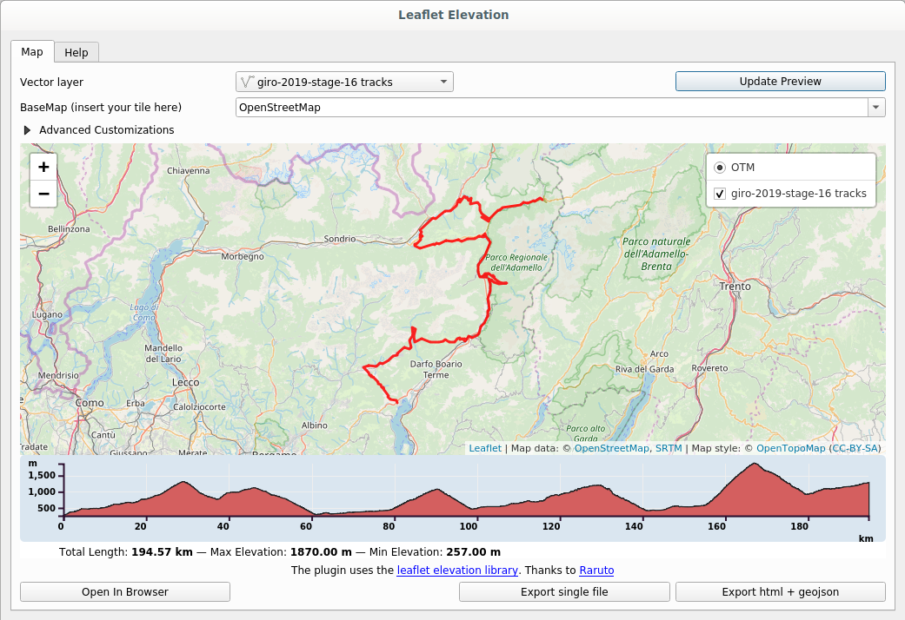

# QGIS TrackProfile2Web Plugin

This plugin allows you to select a line layer with Z values and to create an
interactive elevation profile embedded within QGIS itself:

The workflow is very simple:

1. select a **line** layer loaded in QGIS from the combobox
2. choose the tile map
3. optionally change some customization
4. click on the `Update Preview` button
5. that's it! Just navigate in the map and hover the mouse on the profile to
   see the position on the map

If you want you can export the map as a single `html` file or as `html` +
`geojson`. The results can be easily embedded in a web page.

[Click to see a live example](https://www.faunalia.eu/it/dev/trackprofile2web).

Special thanks to [Raruto](https://github.com/Raruto) and his awesome [leaflet-elevation](https://github.com/Raruto/leaflet-elevation)
library!
